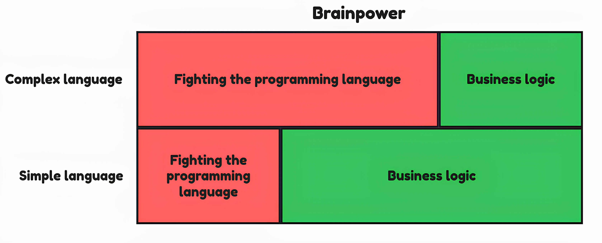

**WARNING:** This project is a work in progress.

# About

**Emerald** is a general-purpose programming language emphasizing simplicity, readability, and safety.

Emerald is designed to be a simple programming language that saves developers' brainpower for the actual work.

# Roadmap

- [x] Lexical analysis
- [x] Parsing
- [ ] Semantical analysis: type-checking, use-after-free, ...
- [ ] Compilation process down to a binary code.
- [ ] Comprehensible and concise error messages.
- [ ] Custom intermidiate representation and backend (?)
- [ ] Multiple architectures and systems support
- [ ] Fast tweak/run cycle.
- [ ] ...

# License

The source code and binaries are licensed under the [*MIT*](./etc/mit-license.txt) license.

    
    

The media files included in this project are licensed under the terms of the [*CC-BY 4.0*](./etc/cc-by-license.txt) license. You are free to share, adapt the media as long as proper attribution is given.
